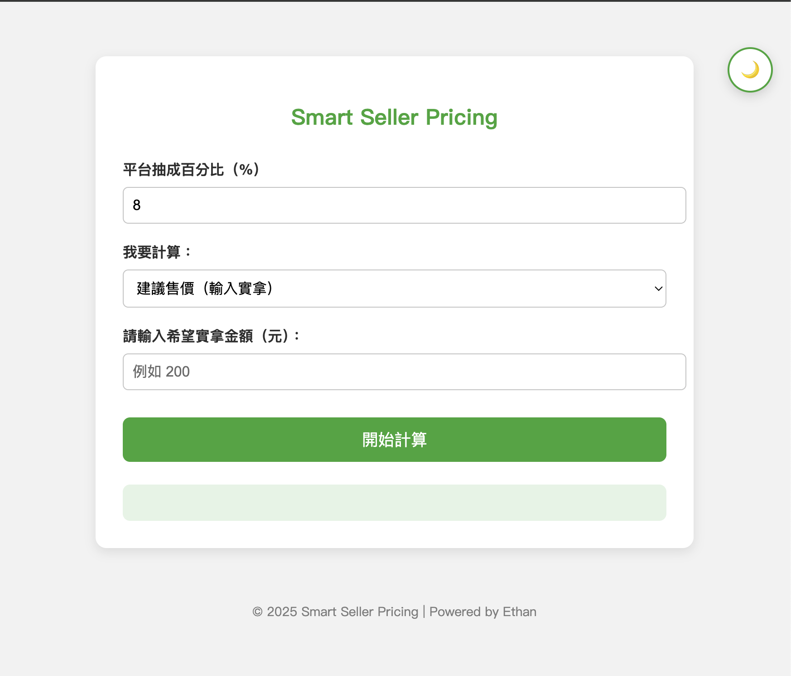
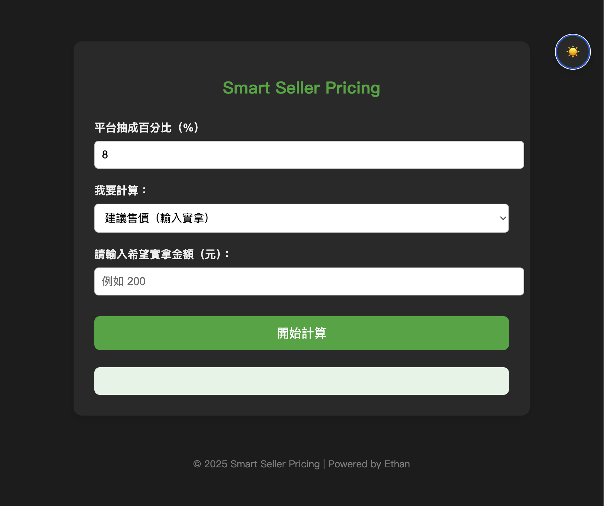

# 🧮 Smart Seller Pricing

一個為電商賣家打造的 **即時售價與平台抽成計算器**。  
透過這個工具，賣家可以根據平台抽成比例，反推建議售價，或快速得知平台實際抽成後自己能拿到多少收入。

## 🔧 使用技術

-   HTML + CSS + JavaScript（Vanilla JS）
-   響應式設計，支援桌機與手機
-   主動式 UX 設計（輸入選擇機制、錯誤提示）
-   暗色/亮色模式切換

## 🎯 使用場景

-   想上架商品到蝦皮、PChome、蝦皮拍賣、NFT/遊戲交易平台
-   想知道「我想賺 240 元，那要賣多少？」
-   想估算「賣 300 元，我會被平台抽多少？」

## 🌐 線上體驗

👉 [Live Demo](https://ethan0417.github.io/smart-seller-pricing/)

## 🧑‍💻 開發動機

> 市面上很多人用手算抽成，或搞不清楚實拿金額。  
> 我希望透過一個介面簡單、反應即時的小工具，幫助創作者、賣家少踩雷，多賺錢 💰！

## 📷 介面截圖

| 亮色模式                       | 暗色模式                     |
| ------------------------------ | ---------------------------- |
|  |  |
